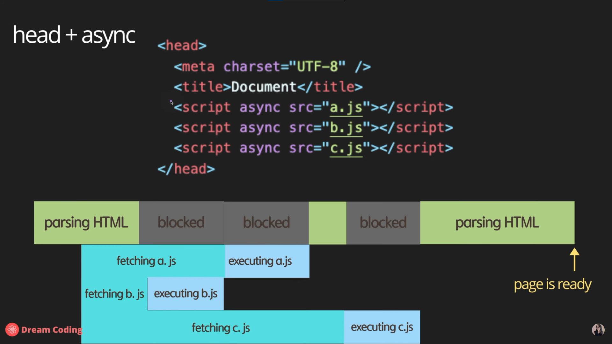

# Javascript 이론 정리(Dream Coding)

> 강의 링크: [자바스크립트 기초 강의 (ES5+): 같이 노트를 작성하며 배워요 📒](https://www.youtube.com/playlist?list=PLv2d7VI9OotTVOL4QmPfvJWPJvkmv6h-2)


[toc]

## HTML에서 JavaScript코드를 가져오는 방법

> async vs defer 비교


1. `<head>`태그 안에서 불러오기

   ```html
   <!DOCTYPE html>
   <html lang="en">
   <head>
     <meta charset="UTF-8">
     <meta http-equiv="X-UA-Compatible" content="IE=edge">
     <meta name="viewport" content="width=device-width, initial-scale=1.0">
     <title>Document</title>
     <script src="main.js"></script>
   </head>
   <body>
     
   </body>
   </html>
   ```

   - 스크립트 태그가 `<head>`태그 안에 있으면 경우 body가 페이지를 그리기 전에 js파일을 로드
   - js 파일의 크기가 크면 완전히 로드되기 전까지 페이지가 로드되지 않아 페이지의 로딩이 그만큼 늦어지는 문제 발생

2. `<body>`태그의 맨 아래에 위치

   ```html
   <!DOCTYPE html>
   <html lang="en">
   <head>
     <meta charset="UTF-8">
     <meta http-equiv="X-UA-Compatible" content="IE=edge">
     <meta name="viewport" content="width=device-width, initial-scale=1.0">
     <title>Document</title>
   </head>
   <body>
     
     <script src="main.js"></script>
   </body>
   </html>
   ```

   - 페이지의 요소 대부분이 js에 의존적이라면 페이지를 제대로 볼 수 없는 문제 발생

3. 비동기 통신 활용

   ```html
   <!DOCTYPE html>
   <html lang="en">
   <head>
     <meta charset="UTF-8">
     <meta http-equiv="X-UA-Compatible" content="IE=edge">
     <meta name="viewport" content="width=device-width, initial-scale=1.0">
     <title>Document</title>
     <script async src="main.js"></script>
   </head>
   ```

   - async를 활용해 비동기로 js 파일을 로드
   - html이 파싱되는 도중에 로드가 완료되면 파싱을 잠시 멈추고 js를 적용
   - html이 파싱되는 중간에 언제 로드가 완료될지 모르기 때문에 js가 필요한 지점을 파싱하는데 아직 로드가 완료되지 않았거나 html이 충분히 파싱되지 않았는데 js의 로드가 완료되어 실행이 되면서 페이지를 보여주는 시점이 늦어질 수 있음

   

   - 다수의 js파일을 로드할 경우 정의된 순서에 상관없이 먼저 로드되는 순서대로 실행되어 js파일들이 순서에 의존적이라면 문제 발생

4. defer 옵션 사용

   ```html
   <!DOCTYPE html>
   <html lang="en">
   <head>
     <meta charset="UTF-8">
     <meta http-equiv="X-UA-Compatible" content="IE=edge">
     <meta name="viewport" content="width=device-width, initial-scale=1.0">
     <title>Document</title>
     <script defer src="main.js"></script>
   </head>
   ```

   - 실질적으로 가장 좋은 옵션
   - js파일은 비동기로 로드하면서 html의 파싱이 완료되면 js를 실행

   

   - 필요한 파일들을 로드한 뒤에 순서대로 실행해 안정적


## 기본 문법

> `'use strict'` 키워드: Javascript는 굉장히 유연한 언어여서 너무 많은 행위가 허용
>
> 다른 언어에서 사용되지 않는 비상식적인 행위(ex. 변수를 선언하지 않고 할당하는 행위 등)를 금지하기 위해 ECMAScript 5에서 도입


### 1. 변수

#### 변수의 선언

- Scope
  - Global
    - 블록 바깥에 선언
    - 어플리케이션이 종료될 때 까지 메모리를 차지
  - Block
    - `{ }` 안쪽에 선언
    - 블록이 끝날때 까지만 메모리를 차지하기 때문에 계속해서 필요한 변수가 아니라면 더 효율적으로 메모리 관리 가능

- `var`
  - Hoisting
    - 변수가 선언된 위치에 관계없이 가장 위에서 선언한 것 처럼 동작
    - 선언하기 전에 변수를 출력하거나 값을 할당할 수 있음
  - `var` 키워드틑 통해 변수를 선언하는 경우에 hoisting 발생
  - Block Scope가 존재하지 않고 항상 Global 변수로 동작
- `let`
  - 변수에 값을 할당한 이후에 재할당 가능
  - mutable한 변수로 선언
- `const`
  - 변수에 값을 한 번 할당하면 재할당 불가능
  - immutable한 변수로 선언
  - 값이 변하지 않아 가장 권장되는 방식
    - 보안상 유리
    - thread safety
    - 실수를 줄일 수 있음


#### 변수의 타입

- 원시 타입: 값을 저장

  - number

    - 굳이 타입을 설정하지 않고 변수에 숫자를 할당하면 알아서 타입 지정
    - `Infinity`, `-Infinity`, `NaN` 등 특수한 형태의 값 존재
    - -2^53 ~ 2^53 사이의 값만 표시 가능

  - bigInt

    - 숫자 뒤에 n을 붙여서 표시
    - 일부 브라우저에서만 지원

  - string

    - 하나의 문자, 문자열 모두 string 타입

    - template literals

      ```js
      const name = hphk
      console.log('Hi' + name + '!')	// Hi hphk!
      console.log(`Hi ${name}!`)		// Hi hphk!
      ```

  - boolean

    - false: `0`, `null`, `undefined`, `Nan`, `''`
    - true: 그 외 전부

  - null

    - 값이 없음을 나타내기 위해 할당

  - undefined

    - 값이 할당되지 않은 경우

  - symbol

    - 동일한 문자열에 대해 서로 다른 고유한 식별자가 필요한 경우
    - `Symbol.for()`를 사용할 경우 인자의 문자열이 같으면 같은 값으로 판단
    - 출력할 때는 `symbol1.description` 의 형태로 출력

    ```js
    const symbol1 = Symbol('id')
    const symbol2 = Symbol('id')
    console.log(symbpl1 === symbpl2) // false
    
    const gsymbol1 = Symbol.for('id')
    const gsymbol2 = Symbol.for('id')
    console.log(symbpl1 === symbpl2) // true
    
    console.log(symbol1) // error 발생
    console.log(symbol1.description) // id
    ```

  - Dynamic Typing

    > 반대는 Static Typing(C, Java 등)

    - 변수의 타입이 선언되는 시점에 결정되는 것이 아니라 프로그램이 동작하면서 할당되는 값이나 연산자에 따라 변화
    - 빠르게 프로토타이핑을 하기 위해서는 유용할 수 있으나 다수의 엔지니어가 공동으로 작업을 하거나 프로젝트의 규모가 커질 경우 문제가 발생할 가능성 존재

- 참조 타입: 값의 주소를 저장

  - object
    - `{ name :'ellie', age: 20}`

- 함수 타입

  - 1급 객체

- Mutable 여부
  - Immutable: 값을 변경 불가
    - 원시 타입 변수, frozen objects(`object.freeze()`)
  - Mutable
    - 참조 타입 변수


### 2. 연산자

#### String concatenate

```js
console.log('my' + 'cat') // mycat
console.log('1' + 2) // 12
console.log(`string litertals: 1 + 2 = ${1 + 2}`)
```

- string literals의 경우 줄바꿈, 따옴표 등 그대로 출력(`\'`나 `\n` 사용할 필요 없음)


#### Numeric operators

- `+`, `-`, `*`, `/`, `%`, `**` 등


#### Increment and decrement operators

```js
let counter = 2
const preIncrement = ++counter
// counter = counter + 1
// preIncrement = counter

const postIncrement = counter++
// postIncrement = counter
// counter = counter + 1
```


#### Assignment operators

- `=`, `+=`, `-=`, `*=`, `/=`


#### Comparison operators

- `<`, `<=`, `>`, `>=`


#### Logical operators

- `||`, `&&`, `!`

- 단축 연산

  - `||`는 하나라도 `true`이면 이후는 확인하지 않음

  - `&&`는 하나라도 `false`이면 이후는 확인하지 않음

    - 다음과 같이 응용 가능

    ```js
    // 모두 동일한 작업
    // && 연산자 이용
    nullableObject && nullableObject.something
    // if문 이용
    if (nullableObject != null) {
        nullableObject.something
    }
    // ?를 붙였을때 null은 false로 판단되어서 속성을 읽으려고 하지 않아 오류도 발생하지 않음
    // 같은 효과인듯
    nullableObject?.something
    ```

  - 따라서 무거운 연산일수록 뒤에서 확인


#### Equality

- `==`, `!=`, `===`, `!==`

    ```js
    const stringFive = '5'
    const numberFive = 5

    // loose equality: 형변환 후 비교
    console.log(stringFive == numberFive) // true
    // strict equality: 형변환 없이 비교
    console.log(stringFive === numberFive) // false
    ```

- object 비교

    ```js
    const e1 = {name: 'ellie'}
    const e2 = {name: 'ellie'}
    const e3 = e1

    // 서로 다른 주소
    console.log(e1 == e2) // false
    console.log(e1 === e2) // false
    // 동일한 주소
    console.log(e1 === e3) // true
    ```

- 헷갈릴만한 상황

    ```js
    console.log(0 == false) // true
    console.log(0 === false) // false
    console.log('' == false) // true
    console.log('' === false) // false
    console.log(null == undefined) // true
    console.log(null === undefined) // false
    ```


#### Conditional operators

- `if`, `else if`, `else`

  ```js
  const name = 'df'
  if (name === 'ellie') {
      console.log('hi ellie')
  } elif (name === 'coder') {
      console.log('hi coder')
  } else {
      console.log('hi')
  }
  ```
  
  

#### Ternary operators

- `condition ? value1 : value2`


#### Switch statement

```js
const browser = 'df'
switch (browser) {
    case 'ellie':
        console.log('hi ellie')
        break
    case 'dream':
    case 'coder':
        console.log('hi dream coder')
        break
    default:
        console.log('hi')
    
}
```

- `break`가 없으면 아래 case에 해당하지 않아도 계속 실행


#### Loops

- `while (condition) {executed}`

  ```js
  let i = 0
  while (i < 3) {
      console.log(`while: ${i}`)
      i++
  }
  ```

  - 조건을 만족하는 동안 실행
  - while: 0
    while: 1
    while: 2
    - 까지 출력

- `do {executed} while (condition)`

  ```js
  let i = 5
  do {
      console.log(`do while: ${i}`)
      i++
  } while (i < 3)
  ```

  - 일단 블록을 한 번 실행하고 조건 확인
  - do while: 5
    - 까지 출력

- `for(begin; condition; step) {executed}`

  ```js
  let i
  for (i = 0; i < 3; i++) {
      console.log(`for: ${i}`)
  }
  ```

  - 위의 `while`문과 사실상 동일

  ```js
  for (let i = 0; i < 3; i++) {
      console.log('inline variable for: ${i}')
  }
  ```

  - 블록 안에서만 쓰이는 지역 변수 선언
  - nested(중첩 반목문), `break`, `continue` 등 사용 가능

- `for (variable in obejct) {executed}`
  - 객체(`object`)의 **속성(key)**들을 순회할 때 사용
  - 배열을 순회하려고 하면 속성에 해당하는 인덱스 값을 순회하게 됨
  - 블록 스코프 생성
- `for (variable of iterables) {executed}`
  - 반복 가능한(iterable) 객체(주로 배열)를 순환하며 **값**을 꺼낼 때 사용
  - 블록 스코프 생성


## Function

### 1. Function declaration

- `function name(param1, param2) { body... return; }`


#### 규칙

- 하나의 함수는 하나의 작업만 수행
- 이름은 동사 + 목적어(doSomething)

- 자바스크립트의 함수는 객체

  - 변수에 담거나, 인자로 넘기거나 반환도 가능

  ```js
  function printHello() {
      console.log('Hello')
  }
  printHello()
  
  function printMessage(message) {
      console.log(message)
  }
  printMessage('hello')
  printMessage(123) // 자바스크립트는 형태가 정해져있지 않기 때문에 가능
  ```

  ```typescript
  // 참고: 타입스크립트는 인자와 반환값의 형태를 명시해야함
  function printMessage(message: string): number {
      console.log(message)
      return 0
  }
  ```


### 2. Parameters

- primitive: passed by value
- object: passed by reference

- Default parameters

  ```js
  function showMessage(message, from = 'unknown') {
      console.log(`${message} by ${from}`)
  }
  showMessage('Hi!')
  ```

  - 인자의 기본값을 설정 가능
  - 설정해 주지 않으면 `undefined`

- Rest parameters

  ```js
  function printAll(...args) {
      for (let i = 0; i < args.length; i++) {
          console.log(args[i])
      }
      
          for (arg of args) {
          console.log(arg)
      }
      
      args.forEach((arg) => console.log(arg))
  }
  printAll('dream', 'coding', 'ellie')
  ```

  - 여러 인자를 배열의 형태로 전달


### 3. Local scope

```js
let globalMessage = 'global'
function printMessage() {
    let localMessage = 'local'
    console.log(globalMessage)
    console.log(localMessage)
}
printMessage()
console.log(globalMessage)
// console.log(localMessage) // Uncaught ReferenceError: localMessage is not defined
```

- 함수 안에서 선언한 변수나 함수는 함수 밖에서 사용 불가능


### 4. Return

- `return`문을 작성하지 않으면 `return undefined`와 동일

- Early Return

  ```js
  function upgradeUser1(user) {
  	if (user.point > 10) {
          // long logic
          // 블록 안에서 너무 긴 로직을 작성하면 가독성이 떨어짐
      }
  }
  
  function upgradeUser(user) {
      if (user.point <= 10) {
          return
          // early return 사용
      }
  
      // long logic
  }
  ```

  

### 5. First-class function

- 함수를 다른 변수처럼 사용가능

- 변수에 할당하거나 다른 함수의 인자로 넘겨주거나 다른 함수의 반환값이 될 수 있음

- Function expression

  ```js
  // 익명함수
  const print = function () {
      consoel.log('print')
  }
  print()
  ```

  - 호이스팅 되지 않음(function declaration은 호이스팅됨)

- Callback function using function expression

  ```js
  function randomQuiz(answer, printYes, printNo) {
      if (answer === 'love you') {
          printYes()
      } else {
          printNo()
      }
  }
  
  // anonymous function
  const printYes = function () {
      console.log('yes!')
  }
  
  // named function
  // better debugging in debugger's stack traces
  // recursion
  const printNo = function print() {
      console.log('no!')
  }
  ```

- Callback function using arrow function

  ```js
  const simplePrint = () => console.log('simplePrint!')
  const add = (a, b) => {
  	// 추가 작업
      return a + b
  }
  ```

- IIFE(Immediately Invoked Function Expression)

  ```js
  (function hello() {
      console.log('IIFE')
  })()
  ```

  - 함수를 선언과 동시에 호출 가능
  - `(함수선언{})()` 형태로 사용


## Class

> class: template
>
> object: instance of a class


### 1. Class 선언

```js
class Person {
    constructor(name, age) {
        this.name = name
        this.age = age
    }
    
    speak() {
        console.log(`${this.name}: hello!`)
    }
}

const ellie = new Person('ellie', 20)
console.log(ellie.name)
console.log(ellie.age)
ellie.speak()
```


### 2. Getter and Setter

```js
class User {
    constructor(firstName, lastName, age) {
        this.firstName = firstName
        this.lastName = lastName
        this.age = age
    }
    
    get age() {
        return this._age
    }
    
    set age(value) {
        this._age = value < 0 ? 0 :value
    }
}
```

- age의 getter와 setter를 설정하면 `this.age`를 부를 때 자동으로 `get age()` 호출하고 `this.age`에 값을 할당할 때 `set age()`를 호출
  - setter 안에서 `this.age = value`를 실행하면 재귀적으로 setter를 계속 호출하게 되기 때문에 `this._age`로 사용


### 3. Private field

```js
class Experiment {
    publicField = 2
    #privateField = 0
}

const experiment = new Experiment()
console.log(experiment.publicField)
console.log(experiment.privateField)
```

- 지원하지 않는 브라우저 존재


### 4. Static

```js
class Article {
    static publisher = 'Dream Coding'
    constructor(articleNumber) {
        this.articleNumber = articleNumber
    }
    
    static printPublisher() {
        console.log(Article.publisher)
    }
}

const article1 = new Article(1)
console.log(article1.publisher)	// undefined
console.log(Article.publisher)	// Dream Coding
```

- 오브젝트에는 할당되지 않고 클래스에만 할당되는 변수 및 메서드


### 5. Inheritance

```js
class Shape {
    constructor(width, height, color) {
        this.width = width
        this.height = height
        this.color = color
    }
    
    draw() {
        console.log(`drawing ${this.color} color of`)
    }
    
    getArea() {
        return this.width * this.height
    }
}

class Rectangle extends Shape {}
class Triangle extends Shape {
    // 오버라이딩
	draw() {
        // 부모 함수 호출
        super.draw()
        console.log('▲')
    }
    
    getArea() {
        return (this.width * this.height) / 2
    }
}

const rectangle = new Rectangle(20, 20, 'blue')
rectangle.draw()
console.log(rectangle.getArea())
const triangle = new Triangle(20, 20, 'red')
triangle.draw()
console.log(triangle.getArea())
```


### 6. Class checking: instanceOf

```js
console.log(rectangle instanceof Rectangle)	// true
console.log(triangle instanceof Rectangle)	// false
console.log(triangle instanceof Triangle)	// true
console.log(triangle instanceof Shape)		// true
console.log(triangle instanceof Object)		// true
```

- 클래스의 부모 클래스인 경우에도 `true`
- 자바스크립트의 모든 오브젝트는 `Object`를 상속받음


## Object

### 1. object란

- 자바스크립트의 데이터 타입 중 하나
- 변수와 함수의 묶음
- 자바스크립트의 거의 모든 object는 Object의 인스턴스


### 2. Literals and properties

```js
const obj1 = {}				// 'object literal' syntax
const obj2 = new Object()	// 'object constructor' syntax

function print(person) {
    console.log(person.name)
    console.log(person.age)
}

const ellie = { name: 'ellie', age: 4}
print(ellie)
```

- key와 value의 쌍으로 이루어짐
- key를 통해 value에 접근 가능


```js
ellie.hasJob = true
console.log(ellie.hasJob)

delete ellie.hasjob
console.log(ellie)
```

- 중간에 새로운 값을 추가하거나 삭제 가능


### 3. Computed properties

```js
console.log(ellie.name)
console.log(ellie['name'])
console.log(ellie.hasJob) // undefined
ellie['hasJob'] = true
console.log(ellie.hasJob) // true

function printValue(obj, key) {
    console.log(obj[key])
}

printValue(ellie, 'name')
```

- property는 항상 문자열로
- 어떤 키에 접근해야 할지가 런타임에 결정될 때 사용


### 4. Property value shorthand

```js
function makePerson(name, age) {
    return {
        name,
        age
    }
    // 다음과 동일
    // return {
    //	name: name,
    //	age: age
	// }
}

const person1 = makePerson('bob', 10)
console.log(person1)
```

- object의 key와 value가 동일하다면 한 번만 써도 됨


### 5. Constructor Function

```js
function Person(name, age) {
    this.name = name
    this.age = age
}

const person2 = new Person('james', 20)
console.log(person2)
```

- 클래스 처럼 쓰면 알아서 object를 생성해주는 함수를 만들어줌


### 6. in operator

```js
console.log('name' in ellie)	// true
console.log('age' in ellie)		// true
console.log('random' in ellie)	// false
```


### 7. `for in` / `for of`

```js
for (key in ellie) {
    console.log(key)
    console.log(ellie[key])
}
```

- object의 key를 순회


```js
const array = [1, 2, 4 ,5]
for (value of array) {
	console.log(value)
}
```


### 8. Cloning

```js
const user = { name: 'ellie', age: 20}
const user2 = user
user.age = 30
console.log(user2.age)
```

- 같은 주소를 가리키기 때문에 변화가 반영됨


```js
const user3 = {}
for (key in user) {
    user3[key] = user[key]
}

const user4 = {}
Object.assign(user4, user)

const user5 = {...user}
user.age = 20
console.log(user3.age)
console.log(user4.age)
console.log(user5.age)
```

- 안에있는 내용을 하나씩 커내서 넣어주거나 `Object.assign(넣어줄 object, 복사 대상 obejct1, obj2, ...)` 함수를 사용하면 변화가 반영되지 않음


```js
const fruit1 = {color: 'red', name: 'apple'}
const fruit2 = {color: 'blue', size: 'big'}
const mixed = Object.assign({}, fruit1, fruit2)
console.log(mixed)
```

- `Object.assign` 함수에 여러 인자를 넣을 때 같은 key를 가지고 있다면 뒤에 넣은 인자가 앞에 넣은 인자를 덮어쓴다는 점에 주의


## Array

### 1. 선언

```js
const arr1 = new Array()
const arr2 = [1, 2]
```


### 2. Index position

```js
const fruits = ['apple', 'banana']
console.log(fruits)
console.log(fruits.length)
console.log(fruits[0])
console.log(fruits[1])
console.log(fruits[2]) // undefined
console.log(fruits[fruits.length - 1]) // 마지막 인덱스 받아오기
```


### 3. Looping over an array

```js
// 1. for
for (let i = 0; i < fruits.length; i++) {
    console.log(fruits[i])
}

// 2. for of
for (fruit of fruits) {
    console.log(fruit)
}

// 3. forEach
fruits.forEach(fruit => console.log(fruit))
fruits.forEach(function (fruit, index, array) {
    console.log(fruit)
    console.log(index)
    console.log(array)
})
```

- `forEach(callbackfn: (value: T, index: number, array: T[]) => void, thisArg?: any): void`
  - `callbackfn`: A function that accepts up to three arguments. forEach calls the callbackfn function one time for each element in the list.
  - `thisArg`: An object to which the this keyword can refer in the callbackfn function. If thisArg is omitted, undefined is used as the this value.


### 4. Addition, deletion, copy

```js
fruits.push('strawberry', 'orange')
console.log(fruits.pop())
console.log(fruits)
```

- 끝에서 데이터를 넣거나 빼는 경우


```js
fruits.unshift('lemon', 'grape')
console.log(fruits)
console.log(fruits.shift())
console.log(fruits)
```

- 앞에서 데이터를 넣거나 빼는 경우
- `pop()`과 `push()`에 비해 느린 연산
  - 복잡도가 O(n)


```js
console.log(fruits.splice(1, 2))
console.log(fruits)
fruits.splice(1, 1, 'lemon')
console.log(fruits)
```

- `splice(start: number, deleteCount?: number): string[]`
  - `deleteCount`를 지정해 주지 않으면 끝까지 모두 삭제
  - `pop()`, `shift()`와 마찬가지로 삭제만 하는 것이 아니라 삭제되는 원소를 반환
  - 삭제하고 그 자리에 다른 데이터를 넣을 수도 있음
    - `splice(idx, 0, 'str')`과 같은 방식으로 원하는 자리에 데이터를 넣기만 하고 삭제하지 않을 수도 있음


```js
const fruits2 = ['apple', 'banana']
const newFruits = fruits.concat(fruits2)
console.log(newFruits)
```

- combine two or more arrays


### 5. Searching

```js
const fruits = ['apple', 'banana', 'apple', 'orange', 'apple']
console.log(fruits.indexOf('banana'))	// 1
console.log(fruits.includes('banana'))	// true
console.log(fruits.indexOf('lemon'))	// -1
console.log(fruits.includes('lemon'))	// false
```

- `indexOf`: 찾고자 하는 데이터가 배열 안에 있으면 인덱스를, 없으면 -1을 반환
- `includes`: 찾고자 하는 데이터가 배열 안에 있으면 `true`를, 없으면 `false`를 반환


```js
console.log(fruits.indexOf('apple'))		// 0
console.log(fruits.lastIndexOf('apple'))	// 4
```

- `lastIndexOf`: 찾고자 하는 데이터 중 가장 마지막 데이터의 인덱스를 반환


### 6. 유용한 배열 관련 메소드들

1) `join(separator?: string): string;`

   - Adds all the elements of an array into a string, separated by the specified separator string.
   - `separator`: A string used to separate one element of the array from the next in the resulting string. If omitted, the array elements are separated with a comma.

2) `string.split(separator: string | RegExp, limit?: number): string[];`

   - Split a string into substrings using the specified separator and return them as an array.
   - `separator`: A string that identifies character or characters to use in separating the string. If omitted, a single-element array containing the entire string is returned.
   - `limit`: A value used to limit the number of elements returned in the array.

3) `reverse(): T[];`

   - Reverses the elements in an array in place.
   - This method **mutates the array** and **returns a reference** to the same array.

4) `slice(start?: number, end?: number): T[];`

   - Returns a copy of a section of an array.
   - For both start and end, a negative index can be used to indicate an offset from the end of the array.
   - For example, -2 refers to the second to last element of the array.
   - `start`: The beginning index of the specified portion of the array.
   - If start is undefined, then the slice begins at index 0.
   - `end`: The end index of the specified portion of the array. This is **exclusive** of the element at the index 'end'.
   - If end is undefined, then the slice extends to the end of the array.

5) `find(predicate: (value: number, index: number, obj: Int8Array) => boolean, thisArg?: any): number | undefined;`

   - Returns the value of the first element in the array where predicate is true, and undefined otherwise.

   - `predicate`: Find calls predicate once for each element of the array, in ascending order, until it finds one where predicate returns true. If such an element is found, find immediately returns that element value. Otherwise, find returns undefined.

   - `thisArg`: If provided, it will be used as the this value for each invocation of  predicate. If it is not provided, undefined is used instead.

     ```js
     s1 = {
         name: 'A', score: 90
     }
     s2 = {
         name: 'B', score: 30
     }
     s3 = {
         name: 'C', score: 60
     }
     students = [s1, s2, s3]
     const test = students.find(function (student, index, obj) {
         console.log(student)
         console.log(index)
         console.log(obj)
     })
     
     const result = students.find(student => student.score === 60)
     console.log(result)
     ```

6) `filter(predicate: (value: number, index: number, array: Int8Array) => any, thisArg?: any): Int8Array;`

   - Returns the elements of an array that meet the condition specified in a callback function.

   - `predicate`: A function that accepts up to three arguments. The filter method calls the predicate function one time for each element in the array.

   - `thisArg`: An object to which the this keyword can refer in the predicate function.

   - If thisArg is omitted, undefined is used as the this value.

     ```js
     const results = students.filter(student => student.score > 50)
     console.log(results)
     ```

7) `map(callbackfn: (value: number, index: number, array: Int8Array) => number, thisArg?: any): Int8Array;`

   - Calls a defined callback function on each element of an array, and returns an array that contains the results.

   - `callbackfn`: A function that accepts up to three arguments. The map method calls the callbackfn function one time for each element in the array.

   - `thisArg`: An object to which the this keyword can refer in the callbackfn function.

   - If thisArg is omitted, undefined is used as the this value.

     ```js
     const scores = students.map(student => student.score)
     console.log(scores)
     ```

8) `some(predicate: (value: number, index: number, array: Int8Array) => unknown, thisArg?: any): boolean;`

   - Determines whether the specified callback function returns true for **any element** of an array.

   - `predicate`: A function that accepts up to three arguments. The some method calls the predicate function for each element in the array until the predicate returns a value which is coercible to the Boolean value true, or until the end of the array.

   - `thisArg`: An object to which the this keyword can refer in the predicate function.

   - If thisArg is omitted, undefined is used as the this value.

- `every(predicate: (value: number, index: number, array: Int8Array) => unknown, thisArg?: any): boolean;`
  - Determines whether **all the members** of an array satisfy the specified test.
  
  - `predicate`: A function that accepts up to three arguments. The every method calls the predicate function for each element in the array until the predicate returns a value which is coercible to the Boolean value false, or until the end of the array.
  
  - `thisArg`: An object to which the this keyword can refer in the predicate function.
  
  - If thisArg is omitted, undefined is used as the this value.
     ```js
     const result = students.some(student => student.score < 50)
     console.log(result)	// true
     const result2 = students.every(student => student.score < 50)
     console.log(result2)// false
     ```

9. `reduce(callbackfn: (previousValue: number, currentValue: number, currentIndex: number, array: Int8Array) => number, initialValue: number): number;`

   - Calls the specified callback function for all the elements in an array. The return value of the callback function is the accumulated result, and is provided as an argument in the next call to the callback function.

   - `callbackfn`: A function that accepts up to four arguments. The reduce method calls the callbackfn function one time for each element in the array.

   - `initialValue`: If initialValue is specified, it is used as the initial value to start the accumulation. The first call to the callbackfn function provides this value as an argument instead of an array value.

     ```js
     const totalScore = students.reduce((prev, curr) => {
         console.log(prev, curr)		// prev: 앞에서 return 된 값 / curr: 이번에 들어온 값
         return prev + curr.score
     }, 0)
     console.log(totalScore)
     ```

   - `reduceRight()`: `currentValue`에 배열의 뒤에서 부터 값 들어옴

10. `sort(compareFn?: (a: number, b: number) => number): this;`

    - Sorts an array.

    - `compareFn`: Function used to determine the order of the elements. It is expected to

      - return a negative value if first argument is less than second argument
      - zero if they're equal
      - and a positive value otherwise.

    - If omitted, the elements are sorted in ascending order.

      ```js
      const sortedScore = students.map(student => student.score)
      //	.sort((a, b) => a - b) // 이렇게만 해도 되는데 설명대로 만들어 봄
      	.sort((a, b) => {
              if (a < b) {
                  return -1
              } else if (a === b) {
                  return 0
              } else {
                  return 1
              }
          })
      console.log(sortedScore)
      ```


## JSON

### 1. Object to JSON

```js
const rabbit = {
    name: 'tori',
    color: 'white',
    size: null,
    birthDate: new Date(),
    symbol: Symbol("id"),
    jump: function() {
        console.log(`${this.name} can jump!`)
    }
}
let json = JSON.stringify(rabbit)
console.log(json)

json = JSON.stringify(rabbit, ['name', 'color'])
console.log(json)

json = JSON.stringify(rabbit, (key, value) => {
    return key === 'name' ? 'ellie' : value
})
console.log(json)
```

- `JSON.stringify` 사용
- Date 오브젝트는 문자열로 변환
- 함수, Symbol 처럼 JSON에 포함되지 않는 데이터 존재
- 원하는 property만 골라서 만들거나 콜백 함수를 통해 변환 가능


### 2. JSON to Object

```js
let json = JSON.stringify(rabbit)
const obj = JSON.parse(json)
console.log(obj)
rabbit.jump()
// obj.jump() // 함수는 JSON에 포함되지 않아 에러 발생
```

- `parse(json)` 사용