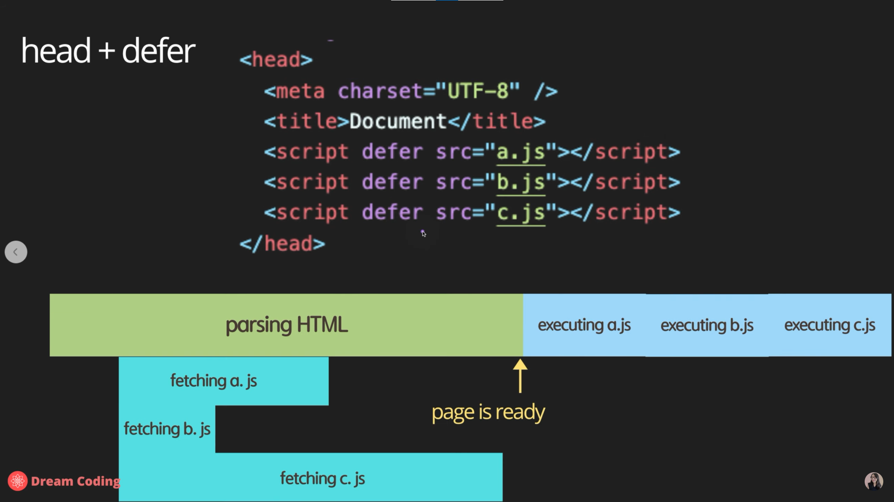

# Javascript 이론 정리(Dream Coding)

[toc]

## HTML에서 JavaScript코드를 가져오는 방법

> async vs defer 비교


1. `<head>`태그 안에서 불러오기

   ```html
   <!DOCTYPE html>
   <html lang="en">
   <head>
     <meta charset="UTF-8">
     <meta http-equiv="X-UA-Compatible" content="IE=edge">
     <meta name="viewport" content="width=device-width, initial-scale=1.0">
     <title>Document</title>
     <script src="main.js"></script>
   </head>
   <body>
     
   </body>
   </html>
   ```

   - 스크립트 태그가 `<head>`태그 안에 있으면 경우 body가 페이지를 그리기 전에 js파일을 로드
   - js 파일의 크기가 크면 완전히 로드되기 전까지 페이지가 로드되지 않아 페이지의 로딩이 그만큼 늦어지는 문제 발생

2. `<body>`태그의 맨 아래에 위치

   ```html
   <!DOCTYPE html>
   <html lang="en">
   <head>
     <meta charset="UTF-8">
     <meta http-equiv="X-UA-Compatible" content="IE=edge">
     <meta name="viewport" content="width=device-width, initial-scale=1.0">
     <title>Document</title>
   </head>
   <body>
     
     <script src="main.js"></script>
   </body>
   </html>
   ```

   - 페이지의 요소 대부분이 js에 의존적이라면 페이지를 제대로 볼 수 없는 문제 발생

3. 비동기 통신 활용

   ```html
   <!DOCTYPE html>
   <html lang="en">
   <head>
     <meta charset="UTF-8">
     <meta http-equiv="X-UA-Compatible" content="IE=edge">
     <meta name="viewport" content="width=device-width, initial-scale=1.0">
     <title>Document</title>
     <script async src="main.js"></script>
   </head>
   ```

   - async를 활용해 비동기로 js 파일을 로드
   - html이 파싱되는 도중에 로드가 완료되면 파싱을 잠시 멈추고 js를 적용
   - html이 파싱되는 중간에 언제 로드가 완료될지 모르기 때문에 js가 필요한 지점을 파싱하는데 아직 로드가 완료되지 않았거나 html이 충분히 파싱되지 않았는데 js의 로드가 완료되어 실행이 되면서 페이지를 보여주는 시점이 늦어질 수 있음

   

   - 다수의 js파일을 로드할 경우 정의된 순서에 상관없이 먼저 로드되는 순서대로 실행되어 js파일들이 순서에 의존적이라면 문제 발생

4. defer 옵션 사용

   ```html
   <!DOCTYPE html>
   <html lang="en">
   <head>
     <meta charset="UTF-8">
     <meta http-equiv="X-UA-Compatible" content="IE=edge">
     <meta name="viewport" content="width=device-width, initial-scale=1.0">
     <title>Document</title>
     <script defer src="main.js"></script>
   </head>
   ```

   - 실질적으로 가장 좋은 옵션
   - js파일은 비동기로 로드하면서 html의 파싱이 완료되면 js를 실행

   

   - 필요한 파일들을 로드한 뒤에 순서대로 실행해 안정적


## 기본 문법

> `'use strict'` 키워드: Javascript는 굉장히 유연한 언어여서 너무 많은 행위가 허용
>
> 다른 언어에서 사용되지 않는 비상식적인 행위(ex. 변수를 선언하지 않고 할당하는 행위 등)를 금지하기 위해 ECMAScript 5에서 도입


### 1. 변수

#### 변수의 선언

- Scope
  - Global
    - 블록 바깥에 선언
    - 어플리케이션이 종료될 때 까지 메모리를 차지
  - Block
    - `{ }` 안쪽에 선언
    - 블록이 끝날때 까지만 메모리를 차지하기 때문에 계속해서 필요한 변수가 아니라면 더 효율적으로 메모리 관리 가능

- `var`
  - Hoisting
    - 변수가 선언된 위치에 관계없이 가장 위에서 선언한 것 처럼 동작
    - 선언하기 전에 변수를 출력하거나 값을 할당할 수 있음
  - `var` 키워드틑 통해 변수를 선언하는 경우에 hoisting 발생
  - Block Scope가 존재하지 않고 항상 Global 변수로 동작
- `let`
  - 변수에 값을 할당한 이후에 재할당 가능
  - mutable한 변수로 선언
- `const`
  - 변수에 값을 한 번 할당하면 재할당 불가능
  - immutable한 변수로 선언
  - 값이 변하지 않아 가장 권장되는 방식
    - 보안상 유리
    - thread safety
    - 실수를 줄일 수 있음


#### 변수의 타입

- 원시 타입: 값을 저장

  - number

    - 굳이 타입을 설정하지 않고 변수에 숫자를 할당하면 알아서 타입 지정
    - `Infinity`, `-Infinity`, `NaN` 등 특수한 형태의 값 존재
    - -2^53 ~ 2^53 사이의 값만 표시 가능

  - bigInt

    - 숫자 뒤에 n을 붙여서 표시
    - 일부 브라우저에서만 지원

  - string

    - 하나의 문자, 문자열 모두 string 타입

    - template literals

      ```js
      const name = hphk
      console.log('Hi' + name + '!')	// Hi hphk!
      console.log(`Hi ${name}!`)		// Hi hphk!
      ```

  - boolean

    - false: `0`, `null`, `undefined`, `Nan`, `''`
    - true: 그 외 전부

  - null

    - 값이 없음을 나타내기 위해 할당

  - undefined

    - 값이 할당되지 않은 경우

  - symbol

    - 동일한 문자열에 대해 서로 다른 고유한 식별자가 필요한 경우
    - `Symbol.for()`를 사용할 경우 인자의 문자열이 같으면 같은 값으로 판단
    - 출력할 때는 `symbol1.description` 의 형태로 출력

    ```js
    const symbol1 = Symbol('id')
    const symbol2 = Symbol('id')
    console.log(symbpl1 === symbpl2) // false
    
    const gsymbol1 = Symbol.for('id')
    const gsymbol2 = Symbol.for('id')
    console.log(symbpl1 === symbpl2) // true
    
    console.log(symbol1) // error 발생
    console.log(symbol1.description) // id
    ```

  - Dynamic Typing

    > 반대는 Static Typing(C, Java 등)

    - 변수의 타입이 선언되는 시점에 결정되는 것이 아니라 프로그램이 동작하면서 할당되는 값이나 연산자에 따라 변화
    - 빠르게 프로토타이핑을 하기 위해서는 유용할 수 있으나 다수의 엔지니어가 공동으로 작업을 하거나 프로젝트의 규모가 커질 경우 문제가 발생할 가능성 존재

- 참조 타입: 값의 주소를 저장

  - object
    - `{ name :'ellie', age: 20}`

- 함수 타입

  - 1급 객체

- Mutable 여부
  - Immutable: 값을 변경 불가
    - 원시 타입 변수, frozen objects(`object.freeze()`)
  - Mutable
    - 참조 타입 변수


### 2. 연산자

#### String concatenate

```js
console.log('my' + 'cat') // mycat
console.log('1' + 2) // 12
console.log(`string litertals: 1 + 2 = ${1 + 2}`)
```

- string literals의 경우 줄바꿈, 따옴표 등 그대로 출력(`\'`나 `\n` 사용할 필요 없음)


#### Numeric operators

- `+`, `-`, `*`, `/`, `%`, `**` 등


#### Increment and decrement operators

```js
let counter = 2
const preIncrement = ++counter
// counter = counter + 1
// preIncrement = counter

const postIncrement = counter++
// postIncrement = counter
// counter = counter + 1
```


#### Assignment operators

- `=`, `+=`, `-=`, `*=`, `/=`


#### Comparison operators

- `<`, `<=`, `>`, `>=`


#### Logical operators

- `||`, `&&`, `!`

- 단축 연산

  - `||`는 하나라도 `true`이면 이후는 확인하지 않음

  - `&&`는 하나라도 `false`이면 이후는 확인하지 않음

    - 다음과 같이 응용 가능

    ```js
    // 모두 동일한 작업
    // && 연산자 이용
    nullableObject && nullableObject.something
    // if문 이용
    if (nullableObject != null) {
        nullableObject.something
    }
    // ?를 붙였을때 null은 false로 판단되어서 속성을 읽으려고 하지 않아 오류도 발생하지 않음
    // 같은 효과인듯
    nullableObject?.something
    ```

  - 따라서 무거운 연산일수록 뒤에서 확인


#### Equality

- `==`, `!=`, `===`, `!==`

    ```js
    const stringFive = '5'
    const numberFive = 5

    // loose equality: 형변환 후 비교
    console.log(stringFive == numberFive) // true
    // strict equality: 형변환 없이 비교
    console.log(stringFive === numberFive) // false
    ```

- object 비교

    ```js
    const e1 = {name: 'ellie'}
    const e2 = {name: 'ellie'}
    const e3 = e1

    // 서로 다른 주소
    console.log(e1 == e2) // false
    console.log(e1 === e2) // false
    // 동일한 주소
    console.log(e1 === e3) // true
    ```

- 헷갈릴만한 상황

    ```js
    console.log(0 == false) // true
    console.log(0 === false) // false
    console.log('' == false) // true
    console.log('' === false) // false
    console.log(null == undefined) // true
    console.log(null === undefined) // false
    ```


#### Conditional operators

- `if`, `else if`, `else`

  ```js
  const name = 'df'
  if (name === 'ellie') {
      console.log('hi ellie')
  } elif (name === 'coder') {
      console.log('hi coder')
  } else {
      console.log('hi')
  }
  ```
  
  

#### Ternary operators

- `condition ? value1 : value2`


#### Switch statement

```js
const browser = 'df'
switch (browser) {
    case 'ellie':
        console.log('hi ellie')
        break
    case 'dream':
    case 'coder':
        console.log('hi dream coder')
        break
    default:
        console.log('hi')
    
}
```

- `break`가 없으면 아래 case에 해당하지 않아도 계속 실행


#### Loops

- `while (condition) {executed}`

  ```js
  let i = 0
  while (i < 3) {
      console.log(`while: ${i}`)
      i++
  }
  ```

  - 조건을 만족하는 동안 실행
  - while: 0
    while: 1
    while: 2
    - 까지 출력

- `do {executed} while (condition)`

  ```js
  let i = 5
  do {
      console.log(`do while: ${i}`)
      i++
  } while (i < 3)
  ```

  - 일단 블록을 한 번 실행하고 조건 확인
  - do while: 5
    - 까지 출력

- `for(begin; condition; step) {executed}`

  ```js
  let i
  for (i = 0; i < 3; i++) {
      console.log(`for: ${i}`)
  }
  ```

  - 위의 `while`문과 사실상 동일

  ```js
  for (let i = 0; i < 3; i++) {
      console.log('inline variable for: ${i}')
  }
  ```

  - 블록 안에서만 쓰이는 지역 변수 선언
  - nested(중첩 반목문), `break`, `continue` 등 사용 가능

- `for (variable in obejct) {executed}`
  - 객체(`object`)의 **속성(key)**들을 순회할 때 사용
  - 배열을 순회하려고 하면 속성에 해당하는 인덱스 값을 순회하게 됨
  - 블록 스코프 생성
- `for (variable of iterables) {executed}`
  - 반복 가능한(iterable) 객체(주로 배열)를 순환하며 **값**을 꺼낼 때 사용
  - 블록 스코프 생성


### 3. Function

#### Function declaration

- `function name(param1, param2) { body... return; }`


#### 규칙

- 하나의 함수는 하나의 작업만 수행
- 이름은 동사 + 목적어(doSomething)

- 자바스크립트의 함수는 객체

  - 변수에 담거나, 인자로 넘기거나 반환도 가능

  ```js
  function printHello() {
      console.log('Hello')
  }
  printHello()
  
  function printMessage(message) {
      console.log(message)
  }
  printMessage('hello')
  printMessage(123) // 자바스크립트는 형태가 정해져있지 않기 때문에 가능
  ```

  ```typescript
  // 참고: 타입스크립트는 인자와 반환값의 형태를 명시해야함
  function printMessage(message: string): number {
      console.log(message)
      return 0
  }
  ```


#### Parameters

- primitive: passed by value
- object: passed by reference

- Default parameters

  ```js
  function showMessage(message, from = 'unknown') {
      console.log(`${message} by ${from}`)
  }
  showMessage('Hi!')
  ```

  - 인자의 기본값을 설정 가능
  - 설정해 주지 않으면 `undefined`

- Rest parameters

  ```js
  function printAll(...args) {
      for (let i = 0; i < args.length; i++) {
          console.log(args[i])
      }
      
          for (arg of args) {
          console.log(arg)
      }
      
      args.forEach((arg) => console.log(arg))
  }
  printAll('dream', 'coding', 'ellie')
  ```

  - 여러 인자를 배열의 형태로 전달


#### Local scope

```js
let globalMessage = 'global'
function printMessage() {
    let localMessage = 'local'
    console.log(globalMessage)
    console.log(localMessage)
}
printMessage()
console.log(globalMessage)
// console.log(localMessage) // Uncaught ReferenceError: localMessage is not defined
```

- 함수 안에서 선언한 변수나 함수는 함수 밖에서 사용 불가능


#### Return

- `return`문을 작성하지 않으면 `return undefined`와 동일

- Early Return

  ```js
  function upgradeUser1(user) {
  	if (user.point > 10) {
          // long logic
          // 블록 안에서 너무 긴 로직을 작성하면 가독성이 떨어짐
      }
  }
  
  function upgradeUser(user) {
      if (user.point <= 10) {
          return
          // early return 사용
      }
  
      // long logic
  }
  ```

  

#### First-class function

- 함수를 다른 변수처럼 사용가능

- 변수에 할당하거나 다른 함수의 인자로 넘겨주거나 다른 함수의 반환값이 될 수 있음

- Function expression

  ```js
  // 익명함수
  const print = function () {
      consoel.log('print')
  }
  print()
  ```

  - 호이스팅 되지 않음(function declaration은 호이스팅됨)

- Callback function using function expression

  ```js
  function randomQuiz(answer, printYes, printNo) {
      if (answer === 'love you') {
          printYes()
      } else {
          printNo()
      }
  }
  
  // anonymous function
  const printYes = function () {
      console.log('yes!')
  }
  
  // named function
  // better debugging in debugger's stack traces
  // recursion
  const printNo = function print() {
      console.log('no!')
  }
  ```

- Callback function using arrow function

  ```js
  const simplePrint = () => console.log('simplePrint!')
  const add = (a, b) => {
  	// 추가 작업
      return a + b
  }
  ```

- IIFE(Immediately Invoked Function Expression)

  ```js
  (function hello() {
      console.log('IIFE')
  })()
  ```

  - 함수를 선언과 동시에 호출 가능
  - `(함수선언{})()` 형태로 사용

