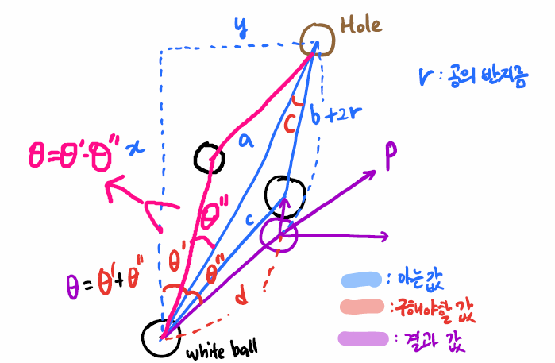

# 당구!

## 계획

### 1. 각도

#### 간단한 각도와 거리 계산

```python
import math

start = (1, 1)
end = (2, 2)


a = abs(end[0] - start[0])
b = abs(end[1] - start[1])

r_1 = math.sqrt(a**2 + b**2)
r_2 = math.hypot(a, b)
r_3 = math.dist(start, end)

radian = math.atan(b / a)
# degree 변환!!! (중요)
print(r_1, r_2, r_3, math.degrees(radian))
```


- 거리는 피타고라스 정리, `math.hypot()`, `math.dist()` 중 택
  - `math.hypot()`: 두 변의 길이를 넣으면 피타고라스 정리로 계산해 주는 함수. 근데 직접 계산하는것도 간단해서 큰 차이는 없다.
  - `math.dist()`는 두 점의 좌표를 넣으면 거리를 계산해 주는 함수. 다만 아래같은 예시 상황에서는 사용 어렵다.

- 각도는 아크탄젠트로 계산한 뒤 radian 값을 degree로 변환 필요


#### 목적구를 홀에 넣기 위한 각도 계산

```python
# θ를 구하기 위한 코드
whiteBall = (white_x, white_y)
targetBall = (target_x, target_y)
hole = (254, 127)
r = 5.73 # 반지름이 아닌 직경

#0. 아는 거리 확인
x = 254 - white_x
y = 127 - white_y
# 같은 결과
# a = math.sqrt(x**2 + y**2)
# b = math.sqrt(abs(254 - target_x)**2 + abs(127 - target_y)**2)
# c = math.sqrt(abs(target_x - white_x)**2 + abs(target_y - white_y)**2)
a = math.dist(whiteBall, hole)
b = math.dist(targetBall, hole)
c = math.dist(whiteBall, targetBall)

#1. 흰 공, 홀, 목적구가 이루는 각도(C) 계산
cos_C = (a**2 + b**2 - c**2) / (2*a*b)
C = math.acos(cos_C) # 라디안값

#2. d(흰 공이 충돌까지 이동할 거리) 계산
# d = math.sqrt((a * math.sin(C))**2 + ((b+r) - a*cos_C)**2)
d = math.hypot((a * math.sin(C)), ((b + r) - a*cos_C))

#3. 홀, 흰 공, 흰 공의 이동경로가 이루는 각도 θ"계산
cos_ang2 = (a**2 + d**2 - (b+r)**2) / (2*a*d)
ang2 = math.acos(cos_ang2)

#4. 나머지 각도 θ' 계산
ang1 = math.atan(x / y)

#5. 실제 구하고자 하는 각도 θ는 ang1 + ang2
angle = round(math.degrees(ang1 + ang2), 4)
print(angle)
```


- 각각의 거리를 구할 때 세가지 방법 중 가능한 방법 아무거나 사용 가능
  - 두 공 간의 거리처럼 좌표를 아는 경우엔 `math.dist()`
  - 계산 과정에서 두 변의 길이를 확인하고 빗변의 길이를 구할 땐 `math.hypot()` 사용하면 편리
- 5.73은 반경이 아닌 직경
  - 즉 **r** = 5.73으로 지정했으면 공식처럼 2 * **r**으로 계산하는 것이 아니라 그대로 **r**사용(헷갈리지 말자)
  - **r**의 또다른 의미는 두 공의 좌표간의 거리가 **r**이 되었을때 접촉한다는 것(활용할 일이 있을까?)
- `math.acos()`과 `math.atan()` 함수는 radian값을 반환하기 때문에 구하고자 하는 각도는 degree값으로 변환이 필요하지만 계산 과정에서 다시 `math.sin()`또는 `math.cos()` 함수에 넣어서 계산할 필요가 있는 경우는 그대로 radian값으로 사용


### 2. 힘

- 흰 공이 충돌까지 이동해야 하는 거리: **d**
- 목적구가 홀에 들어가기 까지 이동해야 하는 거리: **b**

- ?


### 3. 상황에 대한 고려

- 어떤 공을 어느 홀에 넣을지 결정할 방법?
- 각도가 안나오는 경우?
- 만약 흰공 또는 목적구의 이동 경로에 다른 공이 포함된다면? 확인할 방법은?


### 4. 전체 구조

1. 공 하나 선택
2. 홀 결정
3. 경로 확인
4. 문제 없으면 치고 있으면 다음 공 선택 후 2번부터
5. 모든 공을 확인했는데 칠게 없으면 쿠션고려 - 실험 필요
   1. 공 하나 선택
   2. 다른 홀 선택 - 기준 설정 필요
   3. 경로 확인
   4. 문제 없으면 치고 있으면 다음 공 선택


## 현실

### 1. 오전 평가

#### 1-1. 잘한 점

- 계획은 계획일 뿐이었다.
- 주말에 연습한 교수님의 공식을 어느정도는 구현했다.
- 사분면에 따라 **θ1**을 구할 때 아크탄젠트 안에 넣어야 하는 x와 y가 달라지는데 이 부분을 성공적으로 구분했다.
  - 사실 사분면이 짝수 일 때와 홀수 일 때만 나눠주면 되는 문제라 크게 어려운 부분은 아니었다.
- 흰 공과 목적구와 홀의 위치를 비교해 적절한 공과 홀을 선택하는 부분을 성공적으로 구현했다.
  - 먼저 흰 공을 기준으로 목적구의 위치를 사분면으로 표현하고, 목적구의 위치를 전체 당구장을 기준으로 중앙에서 오른쪽인지 왼쪽인지에 따라 홀을 다르게 선택 해 줬다.
  - 다음으로 흰 공이 목적구를 칠 때 최대한 각도를 크게 즉 직선에 가깝게 치는 경우를 선택하도록 했다.


#### 1-2. 못한 점



- 위의 그림 처럼 목적구의 위치에 따라 각도를 더해줘야 하는 경우도 있고, 빼 줘야 하는 경우도 있는데 늦게 알아서 시간이 부족해 해결하지 못하고 제출해버렸다.


### 2. 오후 반 대항전

#### 2-1. 잘한 점

- 오전에 해결하지 못했던 문제를 해결했다.
  - 흰 공과 홀을 지나는 1차함수 형태의 직선을 구하고 이 직선과 비교해 목적구가 위에 있는지 아래에 있는지 구분하는 방식으로 해결했다.


#### 2-2. 못한 점

- 각도를 빼는 과정에서 음수가 나오는 경우가 있었다. 그러면 안된다고 생각이 되지만 시간이 부족해 그냥 절댓값으로 처리했다. 실제로 공을 잘 넣지 못하는 경우가 많았는데 이 부분이 문제가 아니었을까 하는 생각이 든다.

- 목적구를 선택할 때 각도만 고려했는데 실제 경기를 보니 거리를 고려해 주지 않아서 가까이에 혹은 홀 주변에 있는 공을 무시하고 먼 공을 치는 문제가 있었다.
- 이동 경로에 다른 공이 있는지 여부를 확인해야 하는데 전혀 고려해 주지 않아서 8번공을 넣기도 하고 파울이 나오기도 하는 문제가 있었다. 생각은 했던 부분인데 시간이 부족해 구현하지 못한 점이 아쉬웠다.


### 3. 총평

- 준비가 부족했다. 계산 과정만 준비할게 아니라 다른 부분들도 코드로 어느정도 구현해봐야 했다.
- 뭔가 하나를 구현할 때 마다 언패킹 과정에서 변수명을 잘못 쓰거나, 값이 음수가 나오는걸 확인하지 못하거나 하는 실수가 많아서 코드가 제대로 작동하지 않고, 원인을 찾는데 시간을 많이 소비했다. 간단한 내용 하나를 넣는데도 시간이 많이 걸려서 전체적으로 시간이 너무 부족했다.
