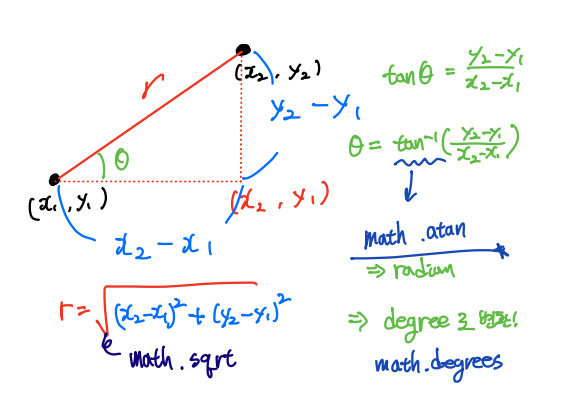
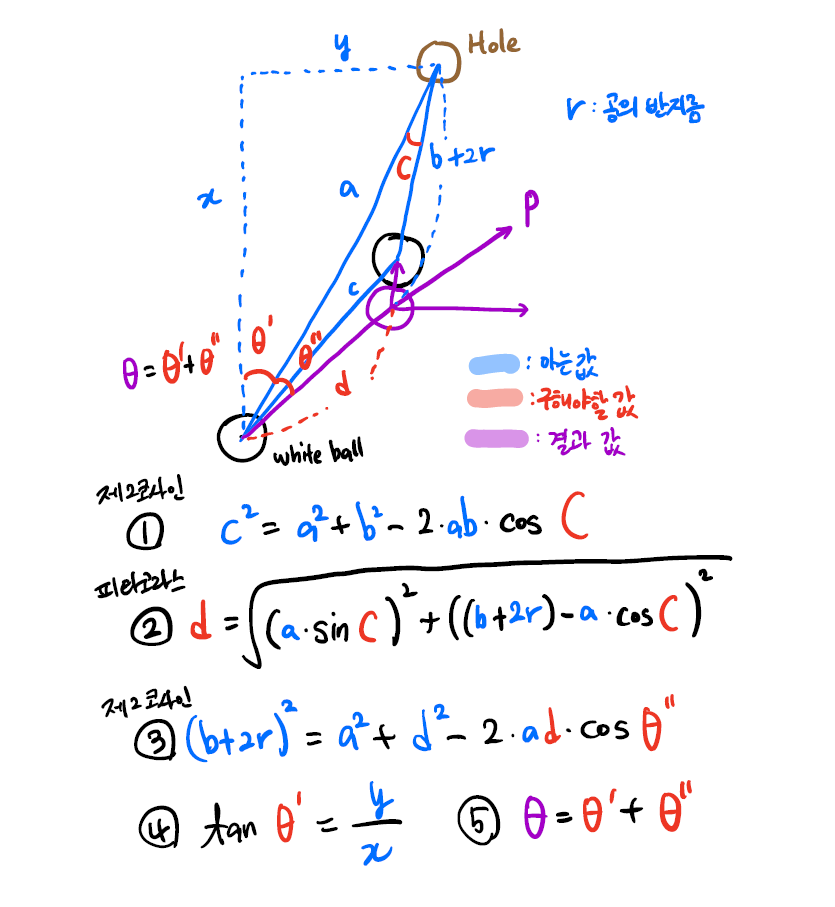

# 당구!


## 간단한 각도와 거리 계산

```python
import math

start = (1, 1)
end = (2, 2)


a = abs(end[0] - start[0])
b = abs(end[1] - start[1])

r_1 = math.sqrt(a**2 + b**2)
r_2 = math.hypot(a, b)
r_3 = math.dist(start, end)

radian = math.atan(b / a)
# degree 변환!!! (중요)
print(r_1, r_2, r_3, math.degrees(radian))
```



- 거리는 피타고라스 정리, `math.hypot()`, `math.dist()` 중 택
  - `math.hypot()`: 두 변의 길이를 넣으면 피타고라스 정리로 계산해 주는 함수. 근데 직접 계산하는것도 간단해서 큰 차이는 없다.
  - `math.dist()`는 두 점의 좌표를 넣으면 거리를 계산해 주는 함수. 다만 아래같은 예시 상황에서는 사용 어렵다.

- 각도는 아크탄젠트로 계산한 뒤 radian 값을 degree로 변환 필요


## 목적구를 홀에 넣기 위한 각도 계산

```python
# θ를 구하기 위한 코드
whiteBall = (white_x, white_y)
targetBall = (target_x, target_y)
hole = (254, 127)
r = 5.73 # 반지름이 아닌 직경

#0. 아는 거리 확인
x = 254 - white_x
y = 127 - white_y
# 같은 결과
# a = math.sqrt(x**2 + y**2)
# b = math.sqrt(abs(254 - target_x)**2 + abs(127 - target_y)**2)
# c = math.sqrt(abs(target_x - white_x)**2 + abs(target_y - white_y)**2)
a = math.dist(whiteBall, hole)
b = math.dist(targetBall, hole)
c = math.dist(whiteBall, targetBall)

#1. 흰 공, 홀, 목적구가 이루는 각도(C) 계산
cos_C = (a**2 + b**2 - c**2) / (2*a*b)
C = math.acos(cos_C) # 라디안값

#2. d(흰 공이 충돌까지 이동할 거리) 계산
# d = math.sqrt((a * math.sin(C))**2 + ((b+r) - a*cos_C)**2)
d = math.hypot((a * math.sin(C)), ((b + r) - a*cos_C))

#3. 홀, 흰 공, 흰 공의 이동경로가 이루는 각도 θ''계산
cos_ang2 = (a**2 + d**2 - (b+r)**2) / (2*a*d)
ang2 = math.acos(cos_ang2)

#4. 나머지 각도 θ' 계산
ang1 = math.atan(x / y)

#5. 실제 구하고자 하는 각도 θ는 ang1 + ang2
angle = ro4(math.degrees(ang1 + ang2))
print(angle)
```



- 각각의 거리를 구할 때 세가지 방법 중 가능한 방법 아무거나 사용 가능
  - 두 공 간의 거리처럼 좌표를 아는 경우엔 `math.dist()`
  - 계산 과정에서 두 변의 길이를 확인하고 빗변의 길이를 구할 땐 `math.hypot()` 사용하면 편리
- 5.73은 반경이 아닌 직경
  - 즉 **r** = 5.73으로 지정했으면 공식처럼 2 * **r**으로 계산하는 것이 아니라 그대로 **r**사용(헷갈리지 말자)
  - **r**의 또다른 의미는 두 공 사이의 거리가 **r**이 되었을때 접촉한다는 것(활용할 일이 있을까?)
- `math.acos()`과 `math.atan()` 함수는 radian값을 반환하기 때문에 구하고자 하는 각도는 degree값으로 변환이 필요하지만 계산 과정에서는 다시 `math.sin()`또는 `math.cos()` 함수에 넣어서 계산할 필요가 있는 경우는 그대로 radian값으로 사용


## 상황에 대한 고려

- 만약 흰공 또는 목적구의 이동 경로에 다른 공이 포함된다면? 확인할 방법은?


