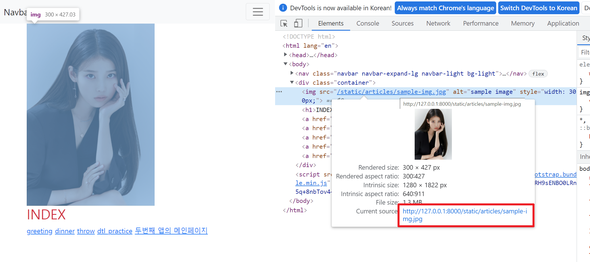

# Django

## 1. Web Framework

### Web

- World Wide Web
- 인터넷에 연결된 컴퓨터를 통해 정보를 공유할 수 있는 전 세계적인 정보 공간


### Static Web Page(정적 웹 페이지)

- 서버에 미리 저장된 파일이 사용자에게 그대로 전달되는 웹 페이지
- 서버가 정적 웹 페이지에 대한 요청을 받아 추가적인 처리 없이 클라이언트에게 응답을 보냄
- 모든 상황에서 모든 사용자에게 동일한 정보 표시
- 일반적으로 HTML, CSS, JavaScript로 작성됨
- flat page라고도 함


### Dynamic Web Page(동적 웹 페이지)

- 웹 페이지에 대한 요청을 받은 경우 서버가 추가정인 처리 과정을 거쳐 클라이언트에게 응답을 보냄
- 동적 웹 페이지는 방문자와 상호작용하기 때문에 페이지 내용은 그때그때 다름
- 서버 사이드 프로그래밍 언어(Python, Java, C++ 등)가 사용되며 파일을 처리하고 데이터베이스와의 상호작용이 이루어짐


### Framework

- 프로그래밍에서 특정 운영 체제를 위한 응용 프로그램 표준 구조를 구현하는 클래스와 라이브러리 모임
- 재사용할 수 있는 수많은 코드를 프레임워크로 통합함으로써 개발자가 새로운 애플리케이션을 위한 표준 코드를 다시 작성하지 않아도 같이 사용할 수 있도록 도움
- Application framework 라고도 함


### Web Framework

- **웹 서비스는 클라이언트가 서버로 요청을 보내고 서버가 클라이언트에게 응답을 보내는 과정**
- 이 때 서버의 구성을 편리하게 해주는 것이 Framework 이며 그 한 종류가 Django
- 웹 페이지를 개발하는 과정에서 겪는 어려움을 줄이는 것이 주 목적으로 데이터베이스 연동, 템플릿 형태의 표준, 세션 관리, 코드 재사용 등의 기능을 포함
- 동적인 웹 페이지나 웹 애플리케이션, 웹 서비스 개발 보조용으로 만들어지는 application framework의 일종


### Framework Architecture

- MVC Design Pattern(model-view-controller)
- 소프트웨어 공학에서 사용되는 디자인 패턴 중 하나
- 사용자 인터페이스로부터 프로그램 로직을 분리하여 애플리케이션의 시각적 요소나 이면에서 실행되는 부분을 서로 영향 없이 쉽게 고칠 수 있는 애플리케이션을 만들 수 있음
- Django는 MTV Pattern이라고 함


### MTV Pattern

- Model
  - 응용프로그램의 **데이터 구조**를 정의하고 **데이터베이스**의 기록을 관리(추가, 수정, 삭제)
- Template
  - 파일의 구조나 레이아웃을 정의
  - **실제 내용을 보여주는데 사용**
- View
  - **중간관리자 역할**
  - HTTP 요청을 수신하고 HTTP 응답을 반환
  - Model을 통해 요청을 충족시키는데 필요한 데이터에 접근
  - Template에게 응답의 서식 설정을 맞김


- 전체적인 구조는 요청이 들어왔을 때 urls.py에서 어떤 함수를 호출할 지 확인하고, views.py에서 적절함 함수를 호출
- 이후 models.py에 정의된 데이터 구조에 따라 데이터를 읽거나 쓰고, 지정된 템플릿을 응답


### Database

#### DB

- 데이터베이스: 체계화된 데이터의 모임
- 쿼리(Query): 데이터를 조회하고, 조건에 맞는 데이터를 추출하거나 조작하는 명령어
  - 쿼리를 날린다고 하는것은 결국 데이터베이스를 조작한다는 것
- 스키마(Schema): 데이터베이스에서 자료의 구조, 표현방법, 관계등을 정의한 구조
- 테이블
  - 열: 필드 또는 속성, 고유한 데이터 형식이 지정
  - 행 레코드 또는 튜플, 데이터가 실제로 저장되는 곳
  - 기본키(Primary Key): 반드시 유니크한 값으로 설정해야 하며, 데이터베이스 관리 및 관계 설정시 주요하게 활용

#### ORM

- Object Relational Mapping
- 객체 지향 프로그래밍 언어를 사용하여 Django와 SQL처럼 호환되지 않는 유형의 시스템 간에 데이터를 변환하는 프로그래밍 기술
- OOP 프로그래밍에서 RDBMS(Relational DataBase Management System)를 연동할 때, 데이터베이스와 객체 지향 프로그래밍 언어간의 호환되지 않는 데이터를 변환하는 프로그래밍 기법
- 장점
  - SQL(Structured Query Language)을 잘 알지 못해도 DB 조작 가능
  - SQL의 절차적 접근이 아닌 객체 지향적 접근으로 인한 높은 생산성
- 단점
  - ORM 만으로는 완전한 서비스를 구현하기 어려운 경우가 있음
- 현대 웹 프레임워크의 요점은 생산성을 높이는 것이기 때문에 DB를 객체처럼 조작하기 위해 ORM사용


### Template

#### Django Template

- 에디터 표현을 제어하는 도구이자 표현에 관련된 로직으로 Django Template Language(DTL) 이라는 빌트인 시스템 사용

#### Django Template Language

- 쟝고의 템플릿에서 사용하는 빌트인 템플릿 시스템
- 조건, 반복, 변수 치환, 필터 등의 기능을 제공
- 단순히 Python이 HTML에 포함 된 것이 아니며, 프로그래밍적 로직이 아닌 단순히 프레젠테이션을 표현하기 위한 것
- 일부 프로그래밍 구조(조건, 반복문 등)를 사용할 수 있지만, python 코드로 실행되는 것이 아님
  1. 변수: `views.py`에서 정의한 변수를 `render()`에 딕셔너리 형태로 넘겨 템플릿 파일에서 사용하는 것
     - `{{ 변수명 }}` 의 형태로 딕셔너리의 키를 변수명으로 사용해 해당하는 값을 사용
     - 변수명은 영,숫자와 밑줄(_)의 조합으로 구성될 수 있으나 밑줄로는 시작 할 수 없음
     - 변수명에 공백이나 구두점 문자를 사용할 수 없음
     - `dot(.)`를 사용하여 변수 속성에 접근
  2. 필터
     - `{{ 변수명|필터:인자 }}`의 형태로 표시할 변수를 수정
     - chained가 가능하며 일부 필터는 인자를 받을 수 있음
  3. 태그
     - ``의 형태로 출력 텍스트를 만들거나 반복 또는 논리를 수행하여 제어 흐름을 만드는 등 변수보다 복잡한 일들을 수행
     - 일부 태그는 종료 태그가 필요
  4. 코멘트
     - `{# 한 줄 주석 #}`의 형태 또는 ` 여러 줄 주석 `의 형태로 주석 사용 가능
  5. 연산
     - DTL을 사용해 연산도 일부 가능하지만 연산은 가능하면 `views.py`에서 모두 마치고 넘겨주는 것이 좋음

### Template Inheritance

- 코드의 재사용성을 위한 템플릿 상속이 가능
- 사이트의 모든 공통 요소를 포함하고, 하위 템플릿이 재정의(override) 할 수 있는 불록을 정의하는 기본 스켈레톤 템플릿 활용
- 최상단에 ``의 형태로 작성해 자식 템플릿이 부모 템플릿을 확장한다는 것을 알림
  - 두개 이상 사용 불가
  - 반드시 템플릿의 첫번째 탬플릿 태그여야 함

- `` ``의 형태로 하위 템플릿에서 override를 통해 채울 수 있는 블록 공간을 정의
  - `endblock`의 `content`는 생략 가능
  - 부모와 자식 템플릿간에 블록 이름(`content`부분)이 동일해야함
- `settings.py`의 TEMPLATES 리스트안에 있는 딕셔너리에서 'DIRS' 부분에 부모 템플릿의 경로를 추가해줘야 함
- 템플릿 내 다른 템플릿을 포함 하는 ``은 단순히 해당 템플릿을 로드해 현재 페이지로 렌더링 하는 것


## Static files

**Static files**

- 정적 파일 
- 응답할 때 별도의 처리 없이 파일 내용을 그대로 보여주면 되는 파일 
- 사용자의 요청에 따라 내용이 바뀌는 것이 아니라 요청한 것을 그대로 보여주는 파일 
- 예를 들어, 웹 사이트는 일반적으로 이미지, 자바 스크립트 또는 CSS와 같은 미리 준비된 추가 파일(움직이지 않는)을 제공해야 함 
- Django에서는 이러한 파일들을 “static file”이라 함

> https://docs.djangoproject.com/en/3.1/howto/static-files/#managing-static-files-e-g-images-javascript-css

<br>

### Static files 구성

1. django.contrib.staticfiles 앱이 `INSTALLED_APPS`에 있는지 확인
2. setting.py에 `STATIC_URL` 정의
3. 템플릿에서 static 템플릿 태그를 사용하여 static file이 있는 상대경로를 빌드
4. 앱에 static file 저장하기 (`my_app/static/my_app/sample.jpg`)

<br>

**Django template tag**

- load
  - 사용자 정의 템플릿 태그 세트를 로드
  - 로드하는 라이브러리, 패키지에 등록된 모든 태그와 필터를 로드
- static
  - STATIC_ROOT에 저장된 정적 파일에 연결

<br>

- 이미지 파일 위치 - `articles/static/articles/images/`
- static file 기본 경로
  - `app_name/static/`

<br>

### The staticfiles app

> https://docs.djangoproject.com/en/3.1/ref/contrib/staticfiles/#module-django.contrib.staticfiles

**`STATICFILES_DIRS`**

```python
STATICFILES_DIRS = [
    BASE_DIR / 'static',
]
```

- app/static/ 디렉토리 경로를 사용하는 것(기본 경로) 외에 추가적인 정적 파일 경로 목록을 정의하는 리스트
- 추가 파일 디렉토리에 대한 전체 경로를 포함하는 문자열 목록으로 작성되어야 함

<br>

**`STATIC_URL`**

```python
STATIC_URL = '/static/'
```

- STATIC_ROOT에 있는 정적 파일을 참조 할 때 사용할 URL 
- 개발 단계에서는 실제 정적 파일들이 저장되어 있는 app/static/ 경로 (기본 경로) 및STATICFILES_DIRS에 정의된 추가 경로들을 탐색함 
- 실제 파일이나 디렉토리가 아니며, URL로만 존재 비어 있지 않은 값으로 설정 한다면 반드시 slash(/)로 끝나야 함

<br>

**`STATIC_ROOT`**

- collectstatic이 배포를 위해 정적 파일을 수집하는 디렉토리의 절대 경로 
- django 프로젝트에서 사용하는 모든 정적 파일을 한 곳에 모아 넣는 경로 
- 개발 과정에서 setting.py의 DEBUG 값이 True로 설정되어 있으면 해당 값은 작용되지 않음 
- 직접 작성하지 않으면 django 프로젝트에서는 setting.py에 작성되어 있지 않음 
- 실 서비스 환경(배포 환경)에서 django의 모든 정적 파일을 다른 웹 서버가 직접 제공하기 위함

> [참고] **collectstatic**
>
> - 프로젝트 배포 시 흩어져있는 정적 파일들을 모아 특정 디렉토리로 옮기는 작업
>
> ```python
> # settings.py 예시
> 
> STATIC_ROOT = BASE_DIR / 'staticfiles'
> ```
>
> ```bash
> $ python manage.py collectstatic
> ```

<b

<br>

#### static file 사용하기

1. 기본경로

   - `article/static/articles/` 경로에 이미지 파일 위치

     ```django
     <!-- articles/index.html -->
     
     
     
     
     
       
       ...
     
     ```

     - 이미지 파일 위치 - `articles/static/articles/`

    - static file 기본 경로

      - `app_name/static/`

2. 추가 경로

   - `static/` 경로에 CSS 파일 위치

```django
<!-- base.html -->

<head>
  
</head>
```

```python
## settings.py

STATICFILES_DIRS = [
    BASE_DIR / 'static',
]
```

```django
<!-- articles/index.html -->





  <link rel="stylesheet" href="">

```

```css
/* static/style.css */

h1 {
    color: crimson;
}
```


<br>

**STATIC_URL 확인해보기**

****


## 3. 진행 순서

```bash
# 환경 세팅
$ python -m venv venv				# 가상환경 생성
$ source venv/Scripts/activate		# 가상환경 활성화
$ pip install django==3.2.12		# 버전 3.2.12로 설치
$ pip install -r requirments		# 혹은 requirements 그대로 설치

# 프로젝트 생성
$ django-admin startproject pjt01 .	# 프로젝트 이름에 하이픈(-)과 사용중인 키워드 사용 불가, 마지막에 . 잊지않기
$ python manage.py startapp app01	# 어플리케이션 생성, 일반적으로는 어플리케이션 이름으로 복수형 사용 권장
$ python manage.py runserver		# 서버 실행

# DB 생성
$ python manage.py makemigrations	# model을 변셩한 것에 기반한 새로운 설계도를 만들 때 사용(DB에 반영은 아직)
$ python manage.py migrate			# 마이그레이션을 실제 DB에 반영해 모델에서의 변경 사항들과 DB의 스키마가 동기화
$ python sqlmigrate					# 마이그레이션에 대한 SQL 구문을 확인해 어떻게 해석되어서 동작할지 미리 확인 가능
$ python showmigrations				# 프로젝트 전체의 마이그레이션 파일들이 migrate 됐는지 여부를 확인 가능
```


## 4. 프로젝트 구조

- `BASE_DIR/`

> `	pjt01/`: 프로젝트 디렉토리
>
> > `__init__.py`: 파이썬이 이 디렉토리를 하나의 파이썬 패키지로 다루도록 지시
> >
> > `asgi.py`: Asynchronous Server Gateway Interface, 애플리케이션이 비동기식 웹 서버와 연결 및 소통하는 것을 도움
> >
> > `settings.py`: 모든 설정을 포함
> >
> > - 수정이 필요한 부분
> >
> >   ```python
> >   INSTALLED_APPS = [
> >       # 순서도 중요!
> >   	# Local apps
> >       'app01',				# 앱 생성시 등록(반드시 생성 후 등록)
> >       
> >       # Third party
> >       'django_extensions',	# 추가기능 사용 위해 등록
> >       
> >       # Django apps
> >       'django.contrib.admin',
> >       'django.contrib.auth',
> >       'django.contrib.contenttypes',
> >       'django.contrib.sessions',
> >       'django.contrib.messages',
> >       'django.contrib.staticfiles',
> >   ]
> >       
> >   TEMPLATES = [
> >       {
> >           'BACKEND': 'django.template.backends.django.DjangoTemplates',
> >           'DIRS': [BASE_DIR / 'templates',],	# base.html을 만들어 기본 템플릿으로 활용 시 경로 등록
> >           'APP_DIRS': True,
> >           'OPTIONS': {
> >               'context_processors': [
> >                   'django.template.context_processors.debug',
> >                   'django.template.context_processors.request',
> >                   'django.contrib.auth.context_processors.auth',
> >                   'django.contrib.messages.context_processors.messages',
> >               ],
> >           },
> >       },
> >   ]
> >       
> >   LANGUAGE_CODE = 'ko-kr'		# 언어 설정, USE_I18N 활성화 필요
> >       
> >   TIME_ZONE = 'Asia/Seoul'	# 시각 설정, USE_TZ = True 필요
> >       
> >   USE_I18N = True				# 번역 시스템 활성화 여부
> >       
> >   USE_L10N = True				# 데이터의 지역화 된 형식을 기본적으로 활성화할지 여부
> >       
> >   USE_TZ = True				# datetimes가 기본적으로 시간대를 인식하는지 여부
> >   ```
> >
> > `urls.py`: 사이트의 url과 적절한 views의 연결을 지정
> >
> > - 기본 구조
> >
> >   ```python
> >   from django.contrib import admin
> >   from django.urls import path, include
> >       
> >   urlpatterns = [
> >       path('admin/', admin.site.urls),		# Django는 기본적으로 admin 페이지 지원
> >       path('app01/', include('app01.urls')),	# 프로젝트의 urls.py의 역할은 특정 앱으로 요청이 들어오면 해당 앱으로 연결하는 것
> >   ]											# 이런 방식을 App URL mapping이라고 함
> >   ```
> >
> > `wsgi.py`: Web Server Gateway Interface, 애플리케이션이 웹서버와 연결 및 소통하는 것을 도움
>
> `manage.py`: Django 프로젝트와 다양한 방법으로 상호작용하는 커맨드라인 유틸리티
>
> - Django와 관련된 명령어를 실행할 때 호출
>
>   ```bash
>   $ python manage.py <conmmad> [options]
>   ```
>
> `app01/`: 앱 디렉토리
>
> > `templates/app01/`: 템플릿 파일들이 속한 디렉토리
> >
> > - Django는 단순히 세팅 파일의 `INSTALLED_APPS` 리스트의 앱들을 위에서부터 확인하며 templates 폴더를 확인하기 때문에 html파일 이름이 동일한 경우에 문제 발생
> > - 따라서 앱 이름의 폴더를 하나 더 만들어 이름공간을 분리
> >
> > > `index.html`: 실제 내용을 보여주는데 파일
> > >
> > > - html 파일을 이용해 파일의 구조나 레이아웃을 정의
> >
> > `__init__.py`
> >
> > `admin.py`: 관리자용 페이지를 설정
> >
> > `apps.py`: 앱의 정보
> >
> > `models.py`: 데이터베이스의 설계도
> >
> > - 구조
> >
> >   ```python
> >   class Article(models.Model):				# django.db.models 모듈의 Model 클래스를 상속받아 서브클래스로 표현
> >       title = models.CharField(max_lenth=10)	# 클래스 속성으로 지정된 필드를 정의해 어떤 타입의 DB 컬럼을 만들지 정의
> >   ```
> >
> > `tests.py`: 프로젝트의 테스트 코드를 작성
> >
> > `urls.py`: 프로젝트의 `urls.py`가 앱의 `urls.py`로 HTTP 요청(request)을 전달 해 주면 알맞은 view 함수로 전달
> >
> > - 구조
> >
> >   ```python
> >   from django.urls import path
> >   from . import views
> >   
> >   app_name = 'articles'										# 앱 이름 지정 필요
> >   
> >   urlpatterns = [
> >       # index: articles/
> >       path('', views.index, name='index'),					# 기본 페이지는 빈 문자열을 이용
> >       # detail: articles/2/ & articles/3/ & articles/4/....
> >       path('<int:article_pk>/', views.detail, name='detail'),	# url주소를 변수로 사용하는 variable routing으로 디폴트 타입은 str
> >       # name인자를 정의해 DTL 태그중 하나인 url 태그에서 사용함으로써 특정한 경로들의 의존성을 해소할 수 있음
> >   ```
> >
> > `views.py`: view 함수들 정의
> >
> > - HTTP 요청을 수신하고 HTTP 응답을 반환하는 함수 작성
> >
> > - Model을 통해 요청에 맞는 필요 데이터에 접근
> >
> > - Template에게 HTTP 응답 서식을 맡김
> >
> > - 구조
> >
> >   ```python
> >   from django.shortcuts import redirect, render
> >   from .models import Article
> >   
> >    def index(request):
> >     	# 필요한 연산
> >   
> >   
> >   	# html로 넘겨줄 데이터는 딕셔너리 형태로
> >   	context = {
> >             'key': value,
> >         }
> >         return render(request, 'articles/index.html', context)
> >   
> >       def create(request):
> >   
> >   
> >   	# 필요한 연산
> >   	return redirect('articles:index')
> >

**[참고]** `runserver` **Automatic reloading**

- 개발 서버는 요청이 들어올 때마다(코드가 저장될 때 마다) 자동으로 Python 코드를 다시 불러온다. 
- 코드의 변경사항을 반영하기 위해서 굳이 서버를 재가동 하지 않아도 된다. 
- 그러나, 파일을 추가하는 등의 몇몇의 동작(커스텀 필터, 새로운 모듈 추가 등)은 개발 서버가 자동으로 인식하지 못하기 때문에, 이런 상황에서는 서버를 재가동 해야 적용되는 경우도 있다.